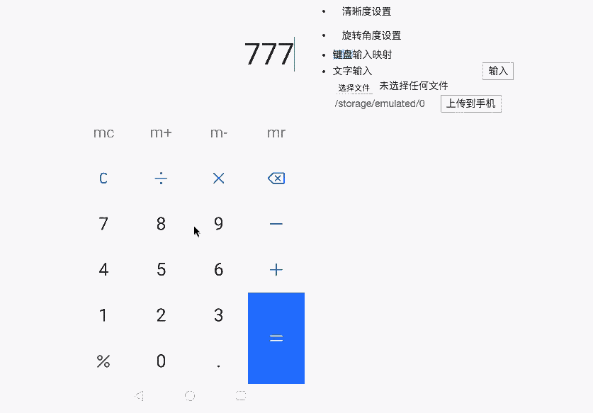

# AndroidControl
这是一款实时控制Android手机的工具

### 包含内容

* 网页端😀
* 客户端😀
* 服务端😀

### 已实现功能
* 显示手机屏幕
* 可对手机进行操作              
    * 单点触摸
    * 滑动
* 设置屏幕的缩放比例
* 设置屏幕的旋转角度
* 键盘映射 (需要修改，目前使用adb命令，速度太慢了)
* 文字输入 (需要修改，目前使用adb命令，速度太慢了)

### 使用方法

1.  使用Gradle构建项目： `gradle jar`
2.  进入到生成的目录：`cd build/libs`
3.  运行服务器（这里使用本地服务器）：`java -jar AndroidControl.jar localserver 6655`
4.  打开`web/index.html`
5.  点击网页中的`设置`，配置IP和端口：`127.0.0.1` `6655`

注意：

* 测试的手机需要打开Debug模式
* 某些手机需要特别开启虚拟按键的权限

### 日后
* 帧数限制，用户可自定义帧数
* 画面清晰度，旋转，缩放设定
* 群控功能，可以控制多台设备
* 操作映射，对一台机器的操作映射到多台机器
* 操作录制、运行(使用脚本语言，js|lua|python语言的支持，可能只实现js)
* 服务器支持
* 流压缩(h264)

### 技术栈介绍
* 核心模块
    * Java
    * C++
    * Android NDK
    * Android ADB
    * Android ddmlib
    * Websocket
    * ... add
* 网页端
    * html5/css3/js/jquery
    * bootstrap
    * ... add
* 客户端
    * ... add

### 感谢
* `minicap` [https://github.com/openstf/minicap](https://github.com/openstf/minicap)
* `minitouch` [https://github.com/openstf/minitouch](https://github.com/openstf/minitouch)