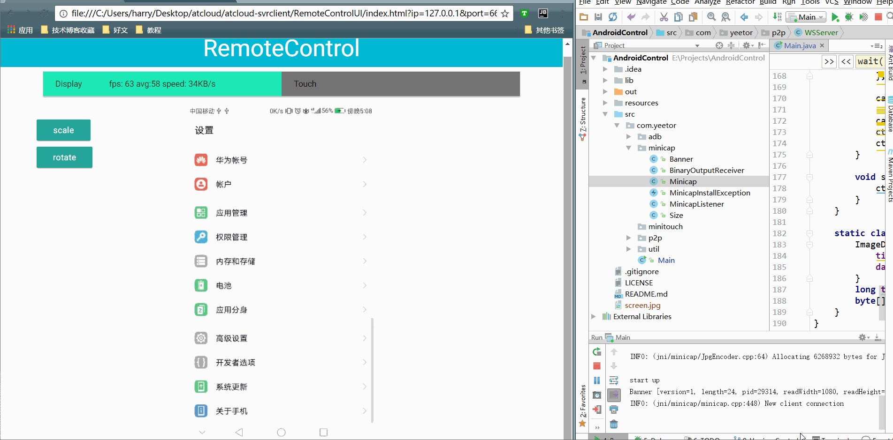

# AndroidControl
这是一款使用浏览器控制Android手机的工具

### 包含内容

* 网页端😀
* 客户端😀
* 服务端😀

### 使用方法

1. 使用Intellij Idea打开项目并运行
2. 打开`web/index.html`，并传入参数 `index.html?ip=127.0.0.1&port=6655`

注意：

* 测试的手机需要打开Debug模式