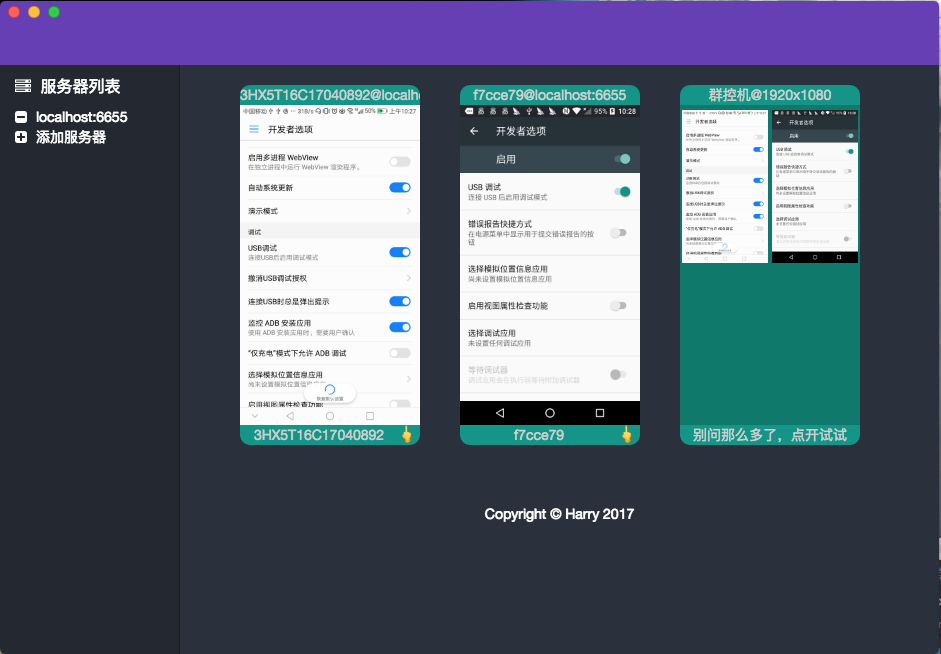
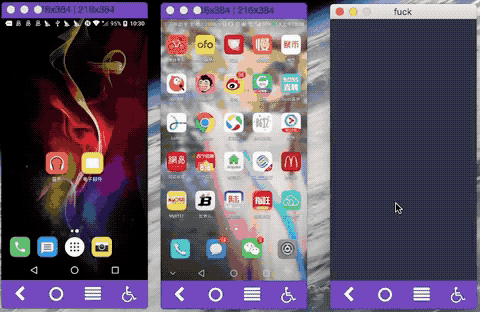

# AndroidControl

**它可以仅仅使用浏览器控制一台或者多台安卓设备，不仅仅局限于手机，如平板、手表等都可以**

**如果有问题或者建议，请加qq群: 1476686**

This is an software for people to control theirs android devices. They can only use a browser to control one or more Android devices. but not  just mobile phones, it still can control pad, watches and more

English Version: translate this

### UI preview






# 如何使用

AndroidControl是一个使用java语言编写的服务器，它是连接电脑和安卓设备的一个桥梁。

你可以选择自己编译运行，也可以使用编译好的版本。

编译好的版本:  [下载地址]()

**Step0:**

请确认你电脑中安装了如下环境

* Java1.8 +.  命令行输入 `java -version`
* adb  命令行输入 `adb version`

**Step1:**

请确认目录结构是这样的

```shell
├── AndroidControl.jar
├── resources
└── yeetor.properties
```

**Step2:**

修改`yeetor.properties`文件，并把同目录下的`resources`目录的绝对路径粘贴到这里

```
resource.root=请把resources目录的路径复制到这里
```

如我的电脑：

```
resource.root=/Users/harry/Documents/AndroidControl_Release
```

**Step3:**

运行`AndroidControl.jar`。注意，请修改为你电脑中的实际路径

```shell
java -jar AndroidControl.jar 
```

**Step4:**

插上你的手机，打开`USB调试模式`

打开浏览器，输入 `http://localhost:6655`

> 部分浏览器会出现不兼容的情况，请选用比较现代的浏览器


# 如何编译

使用Intellij Idea打开本工程...


# 客户端的部署

内置的网页`http://localhost:6655`提供的是简单的功能。如果想用一些强大、自定义的功能，你就需要其他客户端或者自己编写客户端。 

如果想自己编写客户端，请参考内置的客户端以及[协议约定文档](docs/protocol-design.md)编写。

### 替换内置网页客户端

修改`yeetor.properties`所配置`resource`目录中的`web`目录中的内容。 听起来很拗口。。。

注意：只支持静态页面

### 使用其他非网页客户端

我还做了个Native客户端，但还不完善，暂时先不公开了。


# 未来计划

* 实现协议未完成的功能，协议中还有部分功能未完成
* 功能优化
  * 横竖屏切换时的优化
  * 模拟物理按键的响应速度
  * 键盘映射的响应速度
  * 输出帧率控制
  * 视频流压缩
  * 内置adb工具

# 如何贡献

正式版相比demo要减少了很多功能，其很大原因是做了很多代码的中的整理。目的也是想让大家能够比较容易的参与这个项目。

现在项目中有非常非常多的修改点和优化点，在Android领域，实时屏幕、按键模拟、触摸模拟的方法有很多很多。如果能把这些方法整理、整合起来。岂不美哉😉


**欢迎提交PR**